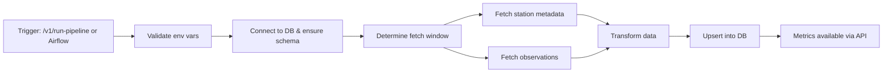
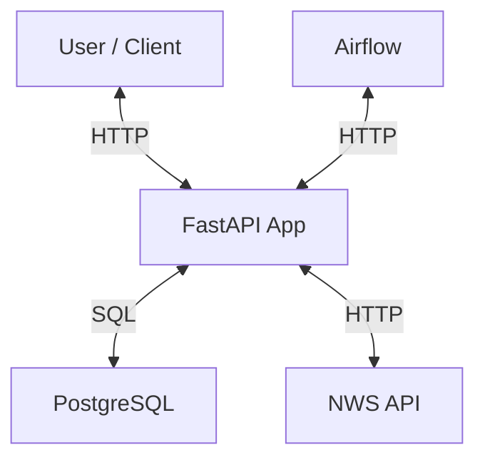

# wx-info: Weather Data Pipeline

Author: Renato Boegeholz <renatoboegeholz@gmail.com>

## Table of Contents

- [1. Project Overview](#1-project-overview)
- [2. Assumptions](#2-assumptions)
- [3. Features & Architecture](#3-features--architecture)
- [4. Quickstart](#4-quickstart)
- [5. Configuration](#5-configuration)
- [6. API Usage](#6-api-usage)
- [7. Metrics Explained](#7-metrics-explained)
- [8. Airflow Integration](#8-airflow-integration)
- [9. Database Direct Access](#9-database-direct-access)
- [10. Development & Testing](#10-development--testing)
- [11. Appendix & Other](#11-appendix--other)

---

## 1. Project Overview

A modular, containerized weather data pipeline using FastAPI, Airflow, Docker, PostgreSQL, and Python.

The pipeline fetches weather data from the National Weather Service API, stores it in a database, and exposes metrics via an API.

---

## 2. Assumptions

- The solution is designed for Dockerized deployment using Docker Compose.
- All configuration (DB URL, station IDs, NWS User-Agent, etc.) is managed via environment variables.
- Station IDs are provided via the NWS_STATION_ID environment variable (single string or JSON array).
- On first run, the pipeline fetches the last 7 days of data; subsequent runs fetch only new data.
- Observations are upserted using station ID and timestamp as a composite primary key to prevent duplicates.
- The pipeline can be triggered via API or Airflow DAG for both manual and scheduled runs.
- All observation timestamps are stored in UTC; station timezone is stored as a string.
- "Humidity" refers to "relative humidity" as provided by the NWS API.
- Additional fields (dewpoint, precipitation_last_hour) are stored for future extensibility.
- Temperature, wind speed, and humidity values are rounded to two decimal places.
- The NWS API requires a custom User-Agent, which must be set via environment variable.
- Automated tests cover core functionality, edge cases, and error handling.

---

## 3. Features & Architecture

- Fetches and stores weather data for one or more stations.
- Exposes a FastAPI-based API for triggering ETL and retrieving metrics.
- Modular, containerized setup for easy deployment.
- Supports Airflow DAG for scheduled/automated runs.

### Pipeline Flow



### Architecture Diagram



### Database Schema (ERD)

```text
+-------------------+---------------------+
| stations          | type                |
+-------------------+---------------------+
| station_id        | TEXT (PK)           |
| station_name      | TEXT                |
| station_timezone  | TEXT                |
| latitude          | DOUBLE PRECISION    |
| longitude         | DOUBLE PRECISION    |
+-------------------+---------------------+

+-------------------------+---------------------+
| weather_observations    | type                |
+-------------------------+---------------------+
| station_id              | TEXT (FK, PK)       |
| observation_timestamp   | TIMESTAMPTZ (PK)    |
| temperature             | DOUBLE PRECISION    |
| dewpoint                | DOUBLE PRECISION    |
| wind_speed              | DOUBLE PRECISION    |
| relative_humidity       | DOUBLE PRECISION    |
| precipitation_last_hour | DOUBLE PRECISION    |
+-------------------------+---------------------+
```

**Note:**  

- All tables are created in the `wxinfo` schema (not the default `public` schema) in PostgreSQL.  
- When connecting or querying directly, use `wxinfo.stations` and `wxinfo.weather_observations`.

---

## 4. Quickstart

### Prerequisites

- Docker and Docker Compose installed and running.
- Python 3.11+ (for scripts/local dev).
- Bash shell (for running provided .sh scripts).
- Internet access (to pull Docker images and fetch weather data from the NWS API).

### Environment Setup

```bash
git clone git@github.com:rboeg/wx-info.git
cd wx-info
```

- Copy `env.example` to `.env`, then review and update all required variables such as `DATABASE_URL` and `NWS_STATION_ID` (see the Configuration section below for details).
- Run the environment setup script for local dev:

```bash
./scripts/env_setup.sh
```

### Running with Docker Compose

**Create Docker network:**

```bash
./scripts/docker_network_setup.sh
```

**(Option 1) Run just the app and its database:**

```bash
docker compose -f docker-compose.app.yml up
```

**(Option 2) Run with Airflow as well:**

```bash
docker compose -f docker-compose.app.yml -f docker-compose.airflow.yml up
```

- FastAPI app: <http://localhost:8000>
- Airflow UI: <http://localhost:8080>

### Stopping Services

```bash
docker compose down
```

---

## 5. Configuration

### Environment Variables

- All configuration is via environment variables (see `env.example`).
- Edit `app/.env` or set variables in your environment.

#### Station ID(s)

- Single station: `NWS_STATION_ID=KATL`
- Multiple stations: `NWS_STATION_ID=["KATL", "003PG"]`

#### NWS API User-Agent (required)

- The National Weather Service API requires a User-Agent string:

```text
NWS_USER_AGENT="myweatherapp.com, contact@myweatherapp.com"
```

This value is sent as the `User-Agent` header in all NWS API requests.

---

## 6. API Usage

### Trigger the Pipeline

**All stations:**

```bash
curl -X POST http://localhost:8000/v1/run-pipeline
```

**Single station:**

```bash
curl -X POST http://localhost:8000/v1/run-pipeline \
  -H 'Content-Type: application/json' \
  -d '{"station_ids": "KATL"}'
```

**Multiple stations:**

```bash
curl -X POST http://localhost:8000/v1/run-pipeline \
  -H 'Content-Type: application/json' \
  -d '{"station_ids": ["KATL", "003PG"]}'
```

**Response (success):**

```json
{
  "status": "Pipeline started",
  "output": "Starting pipeline for station KATL\nNo previous data found. Fetching last 7 days.\nUpserted 133 records for station KATL\nStarting pipeline for station 003PG\nNo previous data found. Fetching last 7 days.\nUpserted 152 records for station 003PG\n"
}
```

**Response (error):**

```json
{"detail": "Weather API not reachable: ..."}
```

### Get Average Temperature (last week)

```bash
curl http://localhost:8000/v1/metrics/average-temperature
```

**Response:**

```json
[
  {
    "station_id": "KATL",
    "avg_temperature": 23.51,
    "first_observation": "2025-06-09T00:00:00+00:00",
    "last_observation": "2025-06-15T23:59:59+00:00"
  },
  {
    "station_id": "003PG",
    "avg_temperature": 19.87,
    "first_observation": "2025-06-09T00:00:00+00:00",
    "last_observation": "2025-06-15T23:59:59+00:00"
  }
]
```

### Get Max Wind Speed Change (last 7 days)

```bash
curl http://localhost:8000/v1/metrics/max-wind-speed-change
```

**Response:**

```json
[
  {
    "station_id": "KATL",
    "max_wind_speed_change": 12.3,
    "first_observation": "2025-06-13T14:00:00+00:00",
    "last_observation": "2025-06-13T15:00:00+00:00"
  },
  {
    "station_id": "003PG",
    "max_wind_speed_change": 9.8,
    "first_observation": "2025-06-12T10:00:00+00:00",
    "last_observation": "2025-06-12T11:00:00+00:00"
  }
]
```

---

## 7. Metrics Explained

### 1. Average Observed Temperature for Last Week

- Computes the average observed temperature for the most recent *full* week prior to the current week (Mon-Sun).
- Ignores null temperature values.

**SQL Query:**

```sql
WITH filtered AS (
  SELECT
    station_id,
    temperature,
    observation_timestamp
  FROM weather_observations
  WHERE observation_timestamp >= date_trunc('week', now()) - interval '7 days'
    AND observation_timestamp < date_trunc('week', now())
    AND temperature IS NOT NULL
)
SELECT
  station_id,
  ROUND(AVG(temperature)::numeric, 2) AS avg_temperature,
  MIN(observation_timestamp) AS first_observation,
  MAX(observation_timestamp) AS last_observation
FROM filtered
GROUP BY station_id;
```

**Explanation:**

- Filters for the last full week (Mon-Sun) with non-null temperature values.
- Computes average, first, and last observation timestamps for each station.

### 2. Maximum Wind Speed Change in the Last 7 Days

- Finds the maximum wind speed change between two consecutive observations in the last 7 days (rolling window).
- Ignores null wind speed values.

**SQL Query:**

```sql
WITH lagged AS (
  SELECT
    station_id,
    wind_speed,
    observation_timestamp,
    LAG(wind_speed) OVER (PARTITION BY station_id ORDER BY observation_timestamp) AS prev_wind_speed,
    LAG(observation_timestamp) OVER (PARTITION BY station_id ORDER BY observation_timestamp) AS prev_observation_timestamp
  FROM weather_observations
  WHERE observation_timestamp >= now() - interval '7 days'
    AND wind_speed IS NOT NULL
),
diffs AS (
  SELECT
    station_id,
    ABS(wind_speed - prev_wind_speed) AS wind_speed_change,
    prev_observation_timestamp,
    observation_timestamp
  FROM lagged
  WHERE prev_wind_speed IS NOT NULL
),
ranked AS (
  SELECT
    *,
    ROW_NUMBER() OVER (PARTITION BY station_id ORDER BY wind_speed_change DESC NULLS LAST) AS rn
  FROM diffs
)
SELECT
  station_id,
  ROUND(wind_speed_change::numeric, 2) AS max_wind_speed_change,
  prev_observation_timestamp AS first_observation,
  observation_timestamp AS last_observation
FROM ranked
WHERE rn = 1;
```

**Explanation:**

- Computes the difference in wind speed between consecutive observations for each station.
- Ranks and returns the maximum change and the timestamps of the two observations involved.

---

## 8. Airflow Integration

- Airflow containers are included for orchestration and scheduling.
- Airflow web UI: <http://localhost:8080>

### Running the Airflow DAG

To run the weather data pipeline DAG in Airflow:

Open the Airflow web interface at <http://localhost:8080>.
Log in with username: airflow and password: airflow (default credentials).
In the DAGs list, find weather_pipeline_dag (it will appear automatically).
You can trigger the DAG manually by clicking the "play" (trigger) button next to its name, or let it run on its schedule.

1. Open Airflow web interface.
2. Log in (default credentials: `airflow`/`airflow`).
3. In the DAGs list, find `weather_pipeline_dag` (it will appear automatically).
4. You can trigger the DAG manually by clicking the "play" (trigger) button next to its name, or let it run on its schedule.

**Multi-Station Example:**

```python
# In dags/weather_pipeline_dag.py
run_pipeline_task = HttpOperator(
    task_id='trigger_weather_pipeline',
    http_conn_id='app_api',
    endpoint='v1/run-pipeline',
    method='POST',
    headers={'Content-Type': 'application/json'},
    data=json.dumps({"station_ids": ["KATL", "003PG"]}),
    log_response=True
)
```

---

## 9. Database Direct Access

- Connect to the PostgreSQL database using any client (e.g., DBeaver).
- Connection details are in your `.env` file.
- Default port: 5432, service name: `postgres` (when using Docker Compose).

**Example connection string:**

```bash
postgresql://<user>:<password>@localhost:5432/<database>
```

---

## 10. Development & Testing

- The `scripts/env_setup.sh` script sets up a local Python environment for development.
- Automated tests are in the `tests/` directory and use `pytest`.
- Tests cover core functionality, edge cases, and error handling.
- CI/CD runs tests on commits and pull requests.

---

## 11. Appendix & Other

- **Troubleshooting:**
  - Ensure all environment variables are set.
  - Check Docker Compose logs for errors.
- **Further documentation:**
  - See code comments and docstrings for more details.

## License

This project is licensed under the [MIT License](LICENSE).
